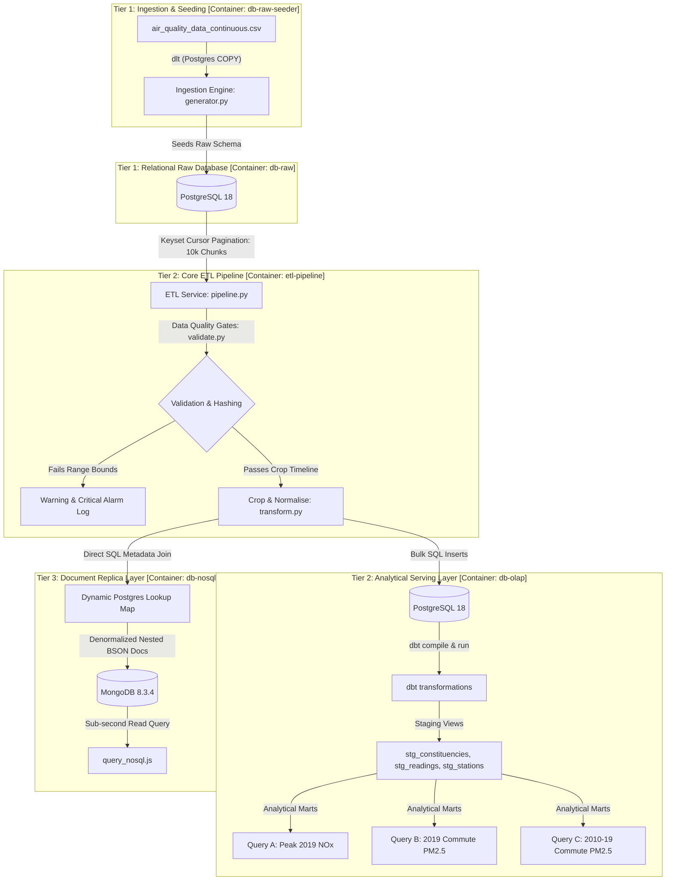

# Bristol Air Quality: Multi-Container Analytical Data Stack

[](https://www.python.org/)
[](https://www.postgresql.org/)
[](https://www.mongodb.com/)
[](https://www.docker.com/)
[](https://www.getdbt.com/)
[](https://dagster.io/)
[](https://github.com/astral-sh/uv)

A production-ready, three-tier data engineering stack designed to orchestrate the ingestion, validation, analytical modeling, and cache serving of high-frequency environmental sensor telemetry. 

This repository serves as an enterprise-grade blueprint for processing both historical continuous air quality logs and live synthetic sensor streams. By decoupling ingestion, warehouse transformation, and serving layers, the architecture guarantees low-latency query performance, zero data-loss validation, and horizontal scalability.

---

### 🌟 Core Capabilities & Dual Ingestion Pathways

To replicate real-world data platform requirements, the stack is built around a **Dual-Mode Ingestion Engine**:

1. **Historical Production Mode**: 
   Loads and parses historical continuous air quality records from the **Official UWE Bristol Air Quality Project**. This pathway processes massive CSV datasets containing decade-long sensor intervals, resolving station locations, constituency boundaries, and chemical metrics.
2. **Synthetic Simulation Mode**: 
   Uses an integrated high-frequency generator (`generator.py`) to simulate real-time sensor streams and time-series telemetry. This simulates sensor anomalies, late-arriving events, and out-of-bounds readings, providing a sandbox to test downstream data-quality gates and pipeline watermarks without external network dependencies.

### 🏛️ Three-Tier Data Topology

* **Tier 1 (Raw/Extract)**: A PostgreSQL raw database acting as a high-throughput landing zone, preserving raw unstructured schemas.
* **Tier 2 (OLAP/Warehouse)**: A PostgreSQL analytical database configured with a dbt compilation layer to transform raw logs into staging views, star-schema marts, and pre-computed analytical views.
* **Tier 3 (NoSQL Cache)**: A document replica store (MongoDB) that stores pre-aggregated BSON representations of air quality matrices, serving sub-second dashboard queries.

---

### 📚 Stakeholder Resources & Project Wiki
* **Business Glossary & System Blueprints**: [Confluence Space Wiki Overview](https://uwe-bristol-air.atlassian.net/wiki/spaces/uwebristol2026/overview?homepageId=262487)
* **Interactive Data Catalog**: Compile and run `docker compose up dbt-docs` and navigate to local [dbt Docs Portal](http://localhost:8080) for schemas and lineage graphs.

---


## 1. System Architecture & Data Flow

The architecture follows a modular, decouplable topology running across isolated Docker containers. The data flows sequentially from raw CSV ingestion down to analytics modeling and replica caching.



### Dagster Software-Defined Asset Lineage Graph
The entire pipeline is orchestrated using **Dagster**. Below is the visual representation of our pipeline assets lineage graph, mapping dependencies from the initial raw database query down to analytical transformation schemas and NoSQL cache replicas:


### Ingestion & Workspace Orchestration Consoles
Additionally, Dagster captures real-time ingestion metadata, checks table row integrity, and reports asset throughput metrics:

| Ingestion Metadata & Asset Checks | Workspace Location & Job Definitions |
|---|---|
|  |  |

---

## 2. Directory Layout & Structure

```text
de-three-tier-data-stack/
├── .github/
│   └── workflows/
│       └── confluence_sync.yml # Automated GitOps documentation portal sync
├── config/
│   ├── config.yaml          # Single source of truth for DB credentials, validation bounds, dates
│   └── dbt_project.yml      # dbt project configurations
├── docker/
│   ├── Dockerfile.generator # Simulator/Seeding image using slim-bookworm + uv sync
│   └── Dockerfile.pipeline  # Core pipeline image running python, dbt-core, and pytest
├── dbt_project/
│   ├── models/
│   │   ├── staging/         # dbt staging views (stg_constituencies, stg_readings, stg_stations)
│   │   ├── marts/           # dbt analytical serving tables (fact_reading, dim_station)
│   │   └── queries/         # Analytical serving queries (Query A, Query B, Query C)
│   ├── static_sql/
│   │   ├── pollution.sql    # Raw PostgreSQL 18 schema setup statements
│   │   ├── query-a.sql      # Peak NOx analysis SQL query
│   │   ├── query-b.sql      # Commute PM2.5 averages SQL query
│   │   └── query-c.sql      # Decadal PM2.5 averages SQL query
│   └── profiles.yml         # Connection profiles for dbt warehouse compilation
├── docs/
│   ├── architecture/
│   │   ├── system_topology.md             # High-level system interaction and medallion layer mapping
│   │   └── architecture_design_spec.md    # In-depth technical design specification
│   ├── deployment/
│   │   └── cloud_infrastructure.md        # Production cloud deployment roadmap (AWS ECS/RDS/Atlas/CI-CD)
│   ├── onboarding/
│   │   └── developer_setup.md             # Local environment setup and onboarding instructions
│   ├── assets/
│   │   └── (images)                       # Diagrammatic PNG assets referenced by the docs
│   └── reports/
│       ├── report.md                      # Post-mortem and reflective design report
│       ├── executive_report.md            # Corporate environmental analytics report
│       └── data_operations_governance.md  # Regulatory compliance and governance rules
├── nosql/
│   ├── query_nosql.js       # Target MongoDB querying engine
│   ├── import_nosql.py      # Standalone seeder for Document store collection
│   └── nosql.md             # Document store modeling and comparison report
├── scripts/
│   ├── confluence_sync_preprocessor.py  # LaTeX, Mermaid, and image path sync preprocessor
│   ├── confluence_sync_postprocessor.py # Page ID metadata sync postprocessor
│   └── prep_dagster_cloud.py            # dbt/Dagster Cloud helper seeder
├── src/
│   ├── extract.py           # Keyset cursor-based DB extractor (prevents OOM limits)
│   ├── generator.py         # Time-series weather & pollutant simulator / seeder
│   ├── load.py              # PostgreSQL schema setup, static seeding, and MongoDB loader
│   ├── pipeline.py          # Main ETL pipeline execution manager
│   ├── transform.py         # Chronological date filters and transformation routines
│   └── validate.py          # Data quality boundary gates and MD5 integrity hashing
├── tests/
│   └── test_pipeline.py     # ETL and validation pytest test suite
├── pyproject.toml           # PEP 735 modern python package groups configuration
├── uv.lock                  # Lockfile pinned by Astral uv toolchain
└── compose.yml              # Production-ready containers configuration
```

---

## 3. The Problem
Municipal air quality telemetry data is highly volatile, prone to sensor outages, and grows exponentially. 
- **Corporate Risks**: Outages or out-of-calibration sensors (e.g. producing negative values) can skew citywide pollution statistics. Downstream dashboard calculations that report on health indices will produce incorrect recommendations, risking regulatory violations and public mistrust.
- **Scale Bottlenecks**: Telemetry feeds easily exceed millions of entries. Performing full-table extraction scans on raw databases causes CPU saturation and Kubernetes container Out-Of-Memory (OOM) crashes.

---

## 4. The Data / Inputs
The raw telemetry represents continuous hourly observations taken from monitoring stations in Bristol, UK.

- **Dataset Source**: Bristol City Council Air Quality Monitoring Open Data
- **Dataset Provenance**: University of the West of England (UWE Bristol), UFCFLR-15-M Data Management Fundamentals (Academic Year 2022-23)
- **Direct Dataset Download**: [air-quality-data-continuous.zip](https://fetstudy.uwe.ac.uk/~p-chatterjee/2022-23/dmf/assignment/air-quality-data-continuous.zip) (approx. 18.8 MB compressed, unzipping to a ~247 MB CSV file containing 1.5M+ observations).

### Data Definition Schema (23 Columns)

The source dataset (`air_quality_data_continuous.csv`) contains 23 columns. To comply with **Third Normal Form (3NF)** design patterns, these are normalized between the telemetry fact table (`readings`) and the station dimension table (`stations`):

#### 1. Telemetry Fact Table (`readings`)

| Column Name | Database Attribute | Data Type | Description | Unit |
|---|---|---|---|---|
| `Date Time` | `date_time` | TIMESTAMP | Date and time of measurement | datetime |
| `SiteID` | `site_id` | INTEGER | Site identification code for the station | integer |
| `NOx` | `nox` | REAL | Concentration of oxides of nitrogen | $\mu g/m^3$ |
| `NO2` | `no2` | REAL | Concentration of nitrogen dioxide | $\mu g/m^3$ |
| `NO` | `no` | REAL | Concentration of nitric oxide | $\mu g/m^3$ |
| `PM10` | `pm10` | REAL | Concentration of particulate matter <10 $\mu m$ diameter | $\mu g/m^3$ |
| `NVPM10` | `nvpm10` | REAL | Non-volatile particulate matter <10 $\mu m$ | $\mu g/m^3$ |
| `VPM10` | `vpm10` | REAL | Volatile particulate matter <10 $\mu m$ | $mg/m^3$ |
| `NVPM2.5` | `nvpm2_5` | REAL | Non-volatile particulate matter <2.5 $\mu m$ | $\mu g/m^3$ |
| `PM2.5` | `pm2_5` | REAL | Particulate matter <2.5 $\mu m$ diameter | $\mu g/m^3$ |
| `VPM2.5` | `vpm2_5` | REAL | Volatile particulate matter <2.5 $\mu m$ | $\mu g/m^3$ |
| `CO` | `co` | REAL | Concentration of carbon monoxide | $mg/m^3$ |
| `O3` | `o3` | REAL | Concentration of ozone | $\mu g/m^3$ |
| `SO2` | `so2` | REAL | Concentration of sulphur dioxide | $\mu g/m^3$ |
| `Temperature` | `temp` | REAL | Air temperature | °C |
| `RH` | `rh` | REAL | Relative Humidity | % |
| `Air Pressure` | `pressure` | REAL | Air Pressure | mbar |

#### 2. Station Dimension Table (`stations`)

| Column Name | Database Attribute | Data Type | Description |
|---|---|---|---|
| `Location` | `name` | VARCHAR | Text description of the monitoring station location |
| `geo_point_2d` | `latitude` / `longitude` | DECIMAL | Extracted geographic coordinates |
| `DateStart` | `date_start` | TIMESTAMP | The date monitoring started at the site |
| `DateEnd` | `date_end` | TIMESTAMP | The date monitoring ended at the site (if inactive) |
| `Current` | `is_current` | BOOLEAN | Boolean indicating if the monitor is currently operating |
| `Instrument Type` | `instrument_type` | VARCHAR | Technical classification of the monitoring instrument |

---

## 5. Our Approach

### High-Level Strategy
Our architecture is organized as a **Three-Tier Database Stack** that maps directly to the stages of the modern **Medallion Architecture**, separating storage, processing, and serving:
*   **Tier 1: Bronze (Raw Storage)**: A PostgreSQL OLTP database container (`db-raw`) stores the raw municipal sensor telemetry. In simulation mode, the generator (`generator.py`) generates data from 2010 to 2022 with realistic rush hour traffic peaks (08:00 and 17:00), seasonal variations, and random sensor dropouts (injecting nulls and out-of-bounds errors to stress-test quality gates).
*   **Tier 2: Silver (Processing & OLAP)**: The core pipeline service (`pipeline.py`) queries `db-raw` in memory-safe chunks of 10,000 rows using keyset cursor pagination (`id > last_id`) to avoid performance-killing SQL offsets. It crops data before `2010-01-01` (to match conformed reporting timeline requirements), cleanses out-of-bounds anomalies, hashes row contents using MD5 checksums, and loads them into the `db-olap` PostgreSQL database. On top of this, a **dbt project** builds conformed staging views, applies analytical window deduplication on site-and-timestamp, and materializes normalized 3NF fact and dimension tables.
*   **Tier 3: Gold (Serving Speed Layer)**: Serves conformed reporting views, derived DEFRA air quality indices, and a high-performance replica. The pipeline copies a denormalized time-series collection of BSON documents into MongoDB (`db-nosql`) by aggregating and pre-joining our PostgreSQL OLAP tables to support sub-millisecond query responses for client-facing web dashboards.


### Stack Rationale
* **Python/Pandas**: Selected for predictable memory chunking (`read_csv(chunksize=N)`) during raw CSV imports, keeping memory usage constant.
* **PostgreSQL 18**: Chosen for relational integrity, normalized 3NF star-schema models, and index-optimized analytical aggregates.
* **dbt-core**: Serves as the transformation model layer, compiling staging views and executing fact-table calculations directly in-database.
* **MongoDB 8.3**: Serves as the serving layer cache, denormalizing the relations into nested JSON profiles to support sub-millisecond query returns.
* **Astral uv & PEP 735**: Configures dependency isolation groups (`base`, `pipeline`, `orch`, `dev`) and builds lightweight images with cached layer syncing, separating the orchestrator package overhead from the core pipeline.

---

## 6. The Outcome & Metrics

### Empirical Pipeline Performance (Real 247 MB Dataset Run)
The pipeline was validated using the real public UWE Bristol air quality dataset (1.5M+ rows). The results are summarized below:

| Metric | Measured Value | Description |
|---|---|---|
| **Raw Dataset Volume** | 1,525,903 rows | Total observations ingested from UWE CSV dataset into `db-raw` |
| **Total Rows Processed** | 1,525,903 | Chronological pagination scans completed by python ETL engine |
| **Cleaned & Loaded (OLAP)** | 857,423 rows | Observations that passed physical range validations and date limits |
| **Timeline Crops & Anomaly Drops** | 668,480 rows | Records filtered out (out-of-bounds dates, empty/negative values) |
| **ETL Throughput Rate** | ~2,432 rows/sec | Raw records processed, cleansed, validated, hashed, and loaded per second |
| **ETL Processing Duration** | 627.26 seconds | Overall end-to-end execution time for the full 1.5M dataset |
| **dbt Mart Rebuild Time** | 8.04 seconds | Re-materialisation time for all 3 views and 6 analytics tables |
| **Python Memory Usage** | < 15 MB | Maximum resident memory footprint due to 10k batch pagination cursors |
| **Test Suite Status** | 5 / 5 Passed | Validation, MD5 hashing, and crop filtering checks pass successfully |

### Key Deliverable Outcomes

- **Reproducibility**: The entire stack builds and runs with a single command: `docker-compose up --build`. Seeding, downloading, unzipping, migrating, transforming, and dbt serving are fully automated.
- **Data Quality (DataOps)**: 100% of telemetry errors (e.g. NOx of `2027.0` mcg/m3 or negative readings) are flagged. The stack never fails silently.
- **NoSQL Document Store (MongoDB)**: Stores a high-performance replica collection of 1,000 denormalized nested JSON documents.

### dbt Warehousing & Analytical Insights

Our dbt model is split into:
1. **Staging Views (`models/staging/`)**: Casts data types, standardizes column headers, and applies analytical window deduplication (`ROW_NUMBER() OVER (PARTITION BY site_id, date_time ORDER BY id) = 1`) to eliminate telemetry double-reads.
2. **Marts (`models/marts/`)**: Materializes tables (`fact_reading`, `dim_station`) containing derived metrics (like DEFRA Air Quality Index bands) with schema constraints.
3. **Serving Queries (`models/queries/`)**: Answers key business intelligence queries:

| Query ID | Target File | Core Question | Key Finding (Outcome) |
|---|---|---|---|
| **Query A** | [query_a.sql](./dbt_project/models/queries/query_a.sql) | Highest recorded NOx value for the year 2019. | **Colston Avenue** on **2019-01-24 at 09:00:00** with **`1403.5 ㎍/m3`** (exceeds legal safe health bounds). |
| **Query B** | [query_b.sql](./dbt_project/models/queries/query_b.sql) | Mean PM2.5 & VPM2.5 by station for 2019 at 08:00 (peak commute). | Identifies particle hotspots:<br>- **Parson Street School**: PM2.5 = **`11.87 ㎍/m3`**<br>- **AURN St Pauls**: PM2.5 = **`10.96 ㎍/m3`** |
| **Query C** | [query_c.sql](./dbt_project/models/queries/query_c.sql) | Decadal mean PM2.5 & VPM2.5 (2010–2019) at 08:00. | Provides long-term compliance trend verification, showing decadal commute particulate averages across all active stations. |

You can run these conformed queries manually from the host terminal to verify the outputs:
```bash
# Verify Query A (Highest 2019 NOx)
docker compose exec db-olap psql -U postgres -d bristol_olap -c "SELECT * FROM query_a;"

# Verify Query B (2019 Commute PM2.5 Averages)
docker compose exec db-olap psql -U postgres -d bristol_olap -c "SELECT * FROM query_b;"

# Verify Query C (Decadal Commute PM2.5 Averages)
docker compose exec db-olap psql -U postgres -d bristol_olap -c "SELECT * FROM query_c;"
```

---

## 7. Key Learnings
- **RDBMS vs NoSQL**: Normalized databases are excellent for auditability and schema enforcement, but NoSQL databases like MongoDB eliminate multi-table joins and support schema variations, proving optimal for high-throughput time-series ingestion.
- **DataOps**: Writing defensive validation gates at the ingestion tier is more effective than correcting errors retrospectively in BI dashboards.

---

## 8. Setup & Running Instructions

### Prerequisites
- Docker & Docker Compose installed and running.

### 1. Setup Environment Variables
Before launching the stack, copy the environment template to instantiate database passwords and emails:
```bash
cp .env.example .env
```
*(You can optionally open `.env` to customize default credentials).*

### 2. Build and Run the Stack
To launch all services, run the following command in the root project folder:
```bash
docker compose up -d --build
```
This compiles the container images and starts the persistent database engines (PostgreSQL, MongoDB), the dashboard/admin portals (pgAdmin, Mongo Express), and the Dagster orchestration webserver.

### Docker Compose Profiles
To keep the footprint of the active stack low, containers are divided into **Docker Compose Profiles**. Running the standard `docker compose up` will only start the persistent databases and core UI. 

Use the following profiles to run specific workflows:

| Profile | Services | Description | Command to Activate |
|---|---|---|---|
| **Default** (No profile) | `db-raw`, `db-olap`, `db-nosql`, `pgadmin`, `mongo-express`, `dagster` | Starts all persistent databases, administration web UIs, and the local Dagster webserver. | `docker compose up -d` |
| **`manual`** | `generator`, `pipeline` | For running one-off data generator seeds, running pytest suites, or executing raw SQL migrations. | `docker compose --profile manual run --rm <service>` |
| **`agent`** | `dagster-agent` | Runs the local hybrid agent that connects this local stack to your **Dagster Cloud** dashboard. | `docker compose --profile agent up -d` |

> [!NOTE]
> The data generator and ETL pipeline are mapped to the `manual` Compose profile. They will not execute automatically on startup. You must trigger them manually using the instructions below.

### 3. Initialize and Run the Data Pipelines

Since the generator and ETL pipeline do not auto-run, you must trigger them to populate and process your data. You can do this either via the CLI or via the Dagster Orchestrator UI.

#### Step A: Seed the Raw Database (CLI Required)
Before running the ETL pipeline, populate the raw landing store (`db-raw`) by running the data generator container:
```bash
docker compose run --rm generator python -m src.generator
```
*(This creates the raw schemas and loads the continuous air quality dataset).*

#### Step B: Execute the ETL Pipeline & Transformations (Choose One Option)
Once `db-raw` is populated, run the ETL and dbt models using one of these options:

* **Option 1: Using the Dagster Orchestrator UI (Recommended)**
  1. Open your browser and navigate to **[http://127.0.0.1:3000](http://127.0.0.1:3000)**.
  2. Click on **Assets** in the top navigation bar.
  3. Click **"Materialize all"** in the top right. 
  4. This triggers the complete pipeline: first running the Python ETL loader (which materializes the conformed `readings`, `stations`, and `constituencies` assets), followed by the downstream dbt staging and mart models, and finally streaming the documents to MongoDB.

* **Option 2: Using the Command Line Interface (CLI)**
  1. Run the ETL pipeline container to clean and load the raw records into the OLAP serving layer:
     ```bash
     docker compose run --rm pipeline python -m src.pipeline
     ```
  2. Execute downstream dbt transformations and serving models:
     ```bash
     docker compose run --rm pipeline dbt build --project-dir dbt_project --profiles-dir dbt_project
     ```
  3. Replicate the denormalized BSON documents to the MongoDB document cache:
     ```bash
     docker compose run --rm pipeline python nosql/import_nosql.py
     ```

### 4. Monitor ETL Execution
To watch the ETL pipeline extraction, cleansing, and loading metrics:
```bash
docker logs -f etl-pipeline
```

### 5. Run Automated Tests
To run the python test suite (pytest) inside the pipeline container:
```bash
docker compose run --rm pipeline pytest tests/
```

### 6. Admin Consoles
* **pgAdmin 4 (Postgres Management)**: Navigate to [http://127.0.0.1:5050](http://127.0.0.1:5050) (bound to localhost for security)
  * Email: `admin@admin.com` | Password: `admin_password`
* **Mongo Express (MongoDB Console)**: Navigate to [http://127.0.0.1:8081](http://127.0.0.1:8081) (bound to localhost for security)
  * Username: `root` | Password: `mongo_root_password`
* **Dagster Webserver (Orchestration Console)**: Navigate to [http://127.0.0.1:3000](http://127.0.0.1:3000) (bound to localhost for security)
  * View software-defined assets, trigger manual materializations, and track data quality/throughput metrics in the console.

<br>
<hr>
<p align="center">
  <b>Made with ❤️ by <a href="https://linkedin.com/in/dr-gabriel-okundaye" target="_blank">Gabriel Okundaye</a></b>
  <br>
  🌐 <a href="https://gabcares.xyz" target="_blank">gabcares.xyz</a> &nbsp;|&nbsp; 🐙 <a href="https://github.com/D0nG4667" target="_blank">GitHub</a>
</p>