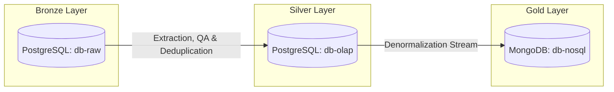

# System Architecture Design Specification
**Project**: Bristol Air Quality Three-Tier Data Stack  

---

## 1. Executive Summary & Design Principles
The Bristol Air Quality stack is architected to transition raw, unvalidated municipal sensor telemetry into audit-compliant, highly optimized analytical products. The architecture respects the **Data Engineering Triad**:
- **Structure**: Modular, containerized services connected via private bridge networks (`bristol-air-net`) with read-only host config injection to prevent environment pollution.
- **Control**: Strict schema validation gates, out-of-bound filters, and cryptographic row checksums (`MD5`) that break pipelines loudly and log error events.
- **Success**: Downstream analytical models modeled in 3NF staging tables, serving dimensional marts (fact/dim models) via `dbt`, and exporting denormalized documents to a NoSQL MongoDB instance.

---

## 2. Ingestion & Storage Architecture (Tier 1)

### Dual-Ingestion Model
The ingestion layer (`db-raw`) accommodates two ingestion modes configured in `config.yaml`:
1. **Simulation Mode (`simulate`)**: Uses a time-series generator to construct hourly observations with mathematical seasonality, weekday commute peaks (08:00 & 17:00), and temperature-pollutant correlations.
2. **Original CSV Ingestion Mode (`csv`)**: Connects to the public municipal dataset. It dynamically downloads the zipped CSV from the data server, auto-detects delimiter format (comma or semicolon), maps columns, and imports records in memory-safe 50,000-row chunks.

### Relational Database Schema (3NF)
We structure the database using PostgreSQL. The Entity-Relationship (ER) model isolates static station metadata and constituency profiles from the high-velocity readings.

```text
  +----------------------+             +---------------------+
  | constituencies       |             | stations            |
  +----------------------+             +---------------------+
  | id [PK]              |<----+       | site_id [PK]        |
  | name (VARCHAR)       |     +------| name (VARCHAR)      |
  | mp_name (VARCHAR)    |             | latitude (DECIMAL)  |
  +----------------------+             | longitude (DECIMAL) |
                                       | constituency_id [FK]|
                                       +---------+-----------+
                                                 |
                                                 v
                                       +---------+-----------+
                                       | readings            |
                                       +---------------------+
                                       | id [PK, SERIAL]     |
                                       | date_time [TIMESTAMP|
                                       | site_id [FK]        |
                                       | nox, no2, no (REAL) |
                                       | pm10, o3 (REAL)     |
                                       | temp (REAL)         |
                                       | ... (other columns) |
                                       | row_checksum (MD5)  |
                                       +---------------------+
```

---

## 3. Transformations & Relational Warehouse (Tier 2)

### dbt Modeling Structure
Rather than query raw tables directly, the serving tier uses `dbt` to structure and transform the raw readings:
- **Staging (`models/staging/`)**: Low-latency views (`stg_constituencies`, `stg_stations`, `stg_readings`) that cast types, sanitize headers, and normalize naming conventions. Specifically, `stg_readings` applies an analytical window deduplication (`ROW_NUMBER() OVER (PARTITION BY site_id, date_time ORDER BY id) = 1`) to filter out telemetry double-reads.
- **Marts (`models/marts/`)**: Materialized analytical tables (`dim_station`, `dim_constituency`, `fact_reading`) optimized for query execution.
  - Derived Metrics: `fact_reading` implements DEFRA air quality indexes and bands directly in the transformation stage using SQL `CASE` statements.
  - Schema Assertions: The final `fact_reading` model is validated on every build via unique and not-null constraints (configured in `marts/schema.yml`) on `reading_id` and `row_checksum` to guarantee warehouse data integrity.
- **Performance Optimizations**:
  - **Composite Indexing**: `CREATE INDEX idx_readings_composite ON readings(site_id, date_time);` accelerates group-by and time-series range scans.
  - **Single-Hour Filtering**: Chronological indexes on the `date_time` column optimize queries targeting specific traffic peaks (like 08:00).

---

## 4. NoSQL Serving Layer (Tier 3)
For downstream web interfaces and real-time dashboard visualizations, joins are prohibitive. The pipeline denormalizes RDBMS tables and streams them to MongoDB.

### Denormalized BSON Model
```json
{
  "_id": {"$oid": "668ba42ff7b5a828e83c2710"},
  "date_time": "2019-10-01T08:00:00",
  "site_id": 188,
  "station": {
    "name": "AURN Bristol Centre",
    "latitude": 51.4572041156,
    "longitude": -2.58564914143,
    "constituency": {
      "name": "Bristol West",
      "mp_name": "Thangam Debbonaire"
    }
  },
  "pollutants": {
    "nox": 110.5,
    "no2": 45.2,
    "no": 65.3,
    "pm10": 18.2,
    "pm2_5": 11.1
  },
  "weather": {
    "temp": 12.5,
    "rh": 65.0,
    "pressure": 1015.0
  },
  "row_checksum": "abcf342938fd89a19234b3f81e83a6c1"
}
```
*Benefits*: Reads execute in $O(1)$ time complexity against the document store without consuming resources on JOIN operations.

---

## 5. Dagster Orchestration & Lineage Observability (DataOps)
To achieve production-grade visibility, the data pipeline is coordinated using **Dagster** as the centralized orchestrator. It manages each pipeline component as a Software-Defined Asset:
- **Software-Defined Asset Nodes**:
  - `raw_readings`: Verifies availability and count of source records inside `db-raw`.
  - `@multi_asset cleaned_readings` (depends on `raw_readings`): A single Python execution block that paginates through `db-raw`, applies inline validations, and yields three distinct database assets: `readings`, `stations`, and `constituencies` into `db-olap`.
  - `dbt_warehouse` (depends on `readings`, `stations`, and `constituencies`): Materializes the dbt staging views and serving marts inside the OLAP database.
  - `mongodb_sample` (depends on `dbt_warehouse`): Queries the serving views and loads a denormalized BSON sample to MongoDB.
- **dbt Translation Layer & Lineage Alignment**:
  We utilize `dagster-dbt` and a custom `DagsterDbtTranslator` subclass. By overriding the `get_asset_key()` method, we map the dbt source tables (`readings`, `stations`, `constituencies` in `sources.yml`) to their corresponding unique output keys from our `@multi_asset`. This connects the Python ETL process and the dbt transformation layer, enabling a complete, single-source visual lineage diagram and ensuring correct run dependency orders (preventing dbt staging queries from running before data is loaded).
- **Observability and Dashboarding**:
  The orchestrator captures performance metadata at the node level (throughput, run times, records loaded vs dropped) and presents them dynamically in the web UI at `http://localhost:3000`. This enables developers to observe pipeline health history and debug latency bottlenecks at a glance.

---

## 6. Conceptual Mapping to the Medallion Architecture
Although structured as a Three-Tier database stack, the design conceptually aligns with the industry-standard **Medallion Architecture** pattern, providing structured, incremental refinement of data quality:



- **Bronze Layer (Tier 1 - Raw Landings)**: Stored in `db-raw`. This layer houses raw, unfiltered municipal observations, allowing duplicate payloads, out-of-bounds metrics, or null values due to sensor failure. This acts as our historical audit trail.
- **Silver Layer (Tier 2 - Cleaned & Conformed)**: Stored in `db-olap` and transformed using `dbt`. Staging views filter out observations outside our crop timeline (pre-2010), drop physical anomalies, and apply windows-based deduplication to resolve duplicate readings. Fact tables then derive conformed attributes, like DEFRA indices.
- **Gold Layer (Tier 3 - Curated Serving)**: Stored in `db-nosql` (MongoDB). Here, the cleaned relational models are pre-joined, denormalized, and structured as nested BSON document models optimized for real-time dashboard consumption.

