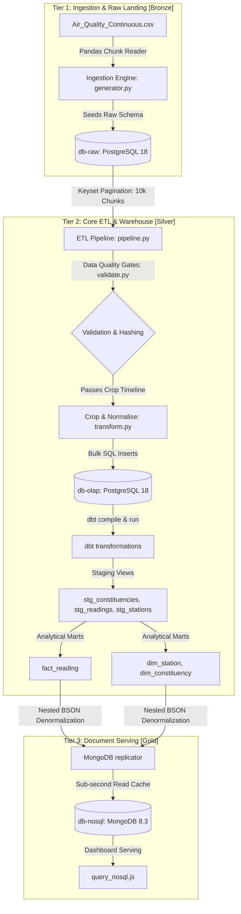

# System Topology

This document details the multi-container topology of the Bristol Air Quality data stack and describes how each tier maps to the medallion architecture stages.

---

## Data Flow Topology

The system operates across isolated Docker containers on a private network (`bristol-air-net`), ensuring secure, modular, and reproducible operations.

---

## Medallion Stage Mapping

Our three-database structure aligns with the **Medallion Architecture** to isolate storage, cleaning, and reporting concerns:

### 1. Bronze Layer (`db-raw`)
* **Purpose**: Serves as the raw municipal sensor landing area and historical audit trail.
* **Characteristics**: Retains raw, unvalidated telemetry records. Includes sensor dropouts (nulls), duplicate timestamps, and out-of-bounds metrics (negative readings) as received from the source.

### 2. Silver Layer (`db-olap`)
* **Purpose**: Cleansed, validated, and normalized corporate data warehouse.
* **Characteristics**:
  - Filtered to retain data from `2010-01-01` onwards.
  - Telemetry anomalies (out-of-bounds dates, invalid pollutant measurements) are removed by inline Python validation gates.
  - Integrity verified via MD5 row checksums (`row_checksum`).
  - Deduplicated using analytical SQL window functions in dbt staging models (`ROW_NUMBER() OVER (PARTITION BY site_id, date_time ORDER BY id) = 1`).
  - Structured into Third Normal Form (3NF) relational tables.

### 3. Gold Layer (`db-nosql`)
* **Purpose**: Performance-optimized serving layer for client dashboards.
* **Characteristics**: Denormalizes the relational schemas into nested BSON document models, eliminating multi-table JOIN latency to support sub-millisecond query returns.

---

## Live Lineage Observability (Dagster)

Below is the verified end-to-end lineage graph generated inside the Dagster web UI. It maps the dependencies starting from the raw database ingestion sensor (`raw_readings`) down to our three-output Python ETL multi-asset (`readings`, `stations`, `constituencies`), the downstream dbt transformations model chain, and finally the denormalized MongoDB replica cache:

