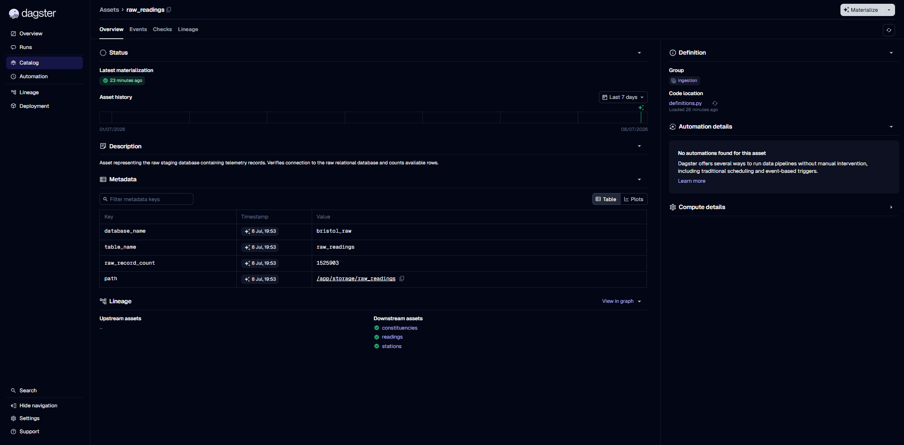
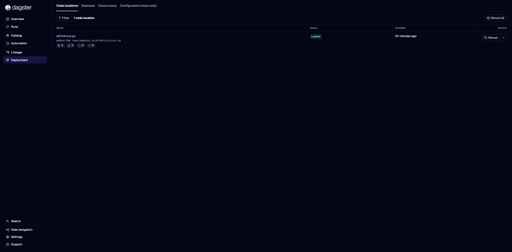
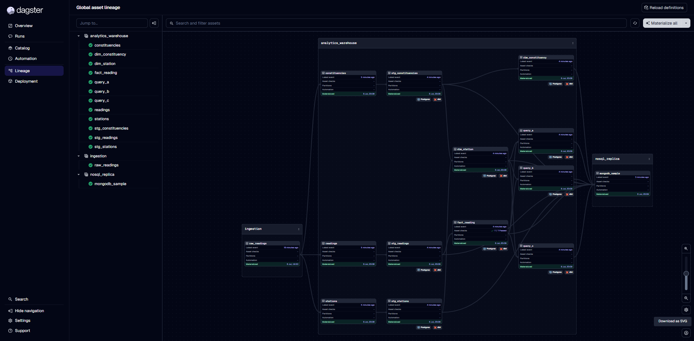
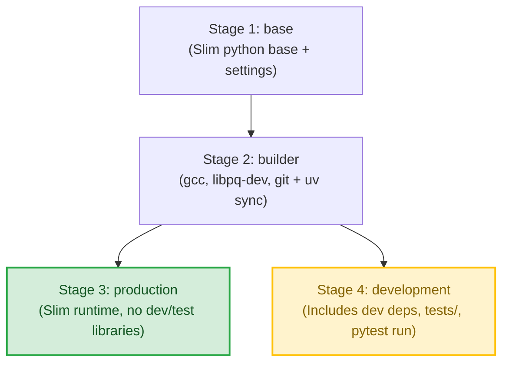
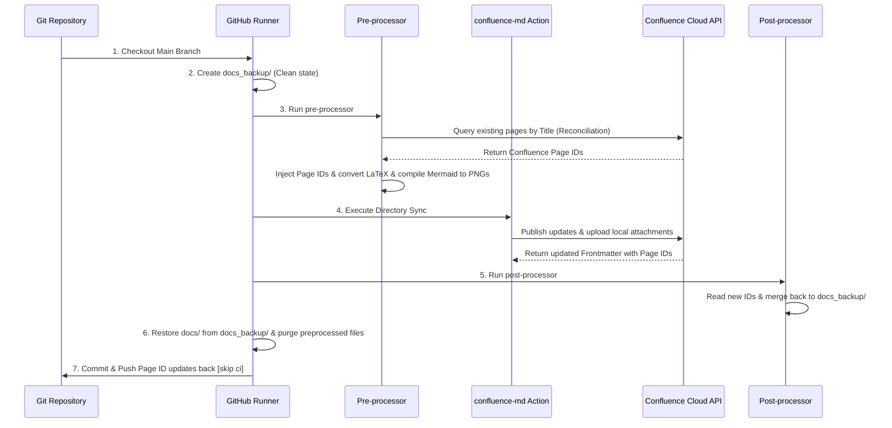

# Developer Setup & Local Onboarding Guide

Welcome to the Bristol Air Quality data stack! This document provides step-by-step instructions to boot the complete multi-container pipeline on your local machine, run test suites, compile models, and inspect the dashboards.

---

## 1. Prerequisites

Ensure you have the following tools installed and running locally:
- **Docker & Docker Compose** (minimum Docker Compose v2.0+)
- **Python 3.11** (optional, for local development outside containers)
- **Astral uv** (optional, recommended package manager for lightning-fast python syncing)

---

## 2. Bootstrapping the Container Stack

The entire three-tier database stack runs in containerized environments. Follow these steps to initialize your environment:

1. **Configure Environment Variables**:
   Copy the template environment file to activate database passwords and settings:
   ```bash
   cp .env.example .env
   ```
   *(You can open `.env` to customize your database passwords if desired).*

2. **Launch Services**:
   Build and start the multi-container stack in detached mode:
   ```bash
   docker compose build
   docker compose up -d
   ```

Verify that the serving daemons are healthy and running:
```bash
docker compose ps
```
You should see:
- `db-raw` (PostgreSQL) - **Healthy** (No host ports exposed for security)
- `db-olap` (PostgreSQL) - **Healthy** (No host ports exposed for security)
- `db-nosql` (MongoDB) - **Healthy** (No host ports exposed for security)
- `dagster-webserver` - **Running** (port 3000 bound to loopback `127.0.0.1`)
- `pgadmin` / `mongo-express` - **Running** (ports 5050 and 8081 bound to loopback `127.0.0.1`)

> [!NOTE]
> In accordance with production-grade separation of concerns, the **data generator** (`generator`) and **ETL pipeline** (`pipeline`) containers are configured with the `manual` Compose profile. They will not show up in the default `docker compose ps` list since they run as discrete, ad-hoc execution jobs rather than background daemons.

---

## 3. Step-by-Step Data Operations

### Step 1: Seed the Raw Landing Database (`db-raw`)
To drop the raw tables, create the 23-column schema matching the UWE Bristol dataset, and import the CSV records (or run simulation if configured), run:
```bash
docker compose run --rm generator python -m src.generator
```
*(This simulates the source system log uploads, preparing `db-raw` for extraction. Once completed, you will see the `raw_readings` metadata populated in the Dagster UI).*



### Step 2: Run the ETL Pipeline (Terminal Option)
If you prefer running the pipeline directly from your CLI without using the Dagster UI, run:
```bash
docker compose run --rm pipeline python -m src.pipeline
```
*(This extracts chunks from `db-raw`, applies data quality validation, hashes records, loads the clean rows into the warehouse `db-olap`, runs dbt models, and replicates a BSON sample to `db-nosql`).*

### Step 3: Run the ETL Pipeline (Dagster UI Option)
1. Open the Dagster web UI: [http://localhost:3000](http://localhost:3000)
2. Go to **Overview** -> **Assets** or the **Lineage** tab.
3. Click the **"Reload definitions"** button in the top-right corner to make sure your workspace is in sync.
4. Click **"Materialize all"** to execute the pipeline with full observability.



*Upon successful materialization of all assets, you will see a fully green-checked, connected pipeline representing your end-to-end data flow:*




---

## 4. Testing & Validation

### Run Automated Tests
To run unit and validation tests using `pytest` inside the development-targeted environment, execute:
```bash
docker compose run --rm dagster pytest tests/
```
*(Note: We run tests inside the `dagster` service container because it is configured with the `development` build stage, which bundles testing libraries like `pytest` and mounts the `/app/tests/` directory. The `pipeline` container targets `production` and does not include these dev packages).*

### Validate Dagster Orchestration Definitions
To verify that your Dagster pipeline graphs, dependencies, and translators are syntactically and logically correct:
```bash
docker compose run --rm dagster dagster definitions validate -f /app/dagster_orch/definitions.py
```

### Verify dbt Compilation
To test that your dbt staging and mart models compile correctly:
```bash
docker compose run --rm pipeline dbt compile --project-dir dbt_project --profiles-dir dbt_project
```

### Verify Analytical SQL Query Results
To run the conformed analytical queries directly against the materialized views inside the OLAP database and inspect the results, run:

#### Query A: Highest recorded NOx in 2019
```bash
docker compose exec db-olap psql -U postgres -d bristol_olap -c "SELECT * FROM query_a;"
```
*Expected Output:*
```text
      date_time      |  station_name  | highest_nox 
---------------------+----------------+-------------
 2019-01-24 09:00:00 | Colston Avenue |      1403.5
(1 row)
```

#### Query B: Commute PM2.5 averages for 2019 at 08:00
```bash
docker compose exec db-olap psql -U postgres -d bristol_olap -c "SELECT * FROM query_b;"
```
*Expected Output:*
```text
     station_name     |     mean_pm2_5     | mean_vpm2_5 
----------------------+--------------------+-------------
 AURN St Pauls        | 10.963870994506344 |            
 Brislington Depot    |                    |            
 Colston Avenue       |                    |            
 Fishponds Road       |                    |            
 Parson Street School | 11.870881795883179 |            
 Temple Way           |                    |            
 Wells Road           |                    |            
(7 rows)
```

#### Query C: Decadal Commute PM2.5 averages (2010–2019) at 08:00
```bash
docker compose exec db-olap psql -U postgres -d bristol_olap -c "SELECT * FROM query_c;"
```
*Expected Output:*
```text
           station_name           |     mean_pm2_5     |    mean_vpm2_5    
----------------------------------+--------------------+-------------------
 AURN St Pauls                    | 12.501938892143492 | 2.959303245414417
 Bath Road                        |                    |                  
 Brislington Depot                |                    |                  
 CREATE Centre Roof               |                    |                  
 Cheltenham Road \ Station Road   |                    |                  
 Colston Avenue                   |                    |                  
 Fishponds Road                   |                    |                  
 Newfoundland Road Police Station |                    |                  
 Old Market                       |                    |                  
 Parson Street School             | 11.870881795883179 |                  
 Rupert Street                    |                    |                  
 Shiner's Garage                  |                    |                  
 Temple Way                       |                    |                  
 Wells Road                       |                    |                  
(14 rows)
```

---

## 5. Local Dashboard Portals

Once the containers are up, you can access these local management dashboards:

| Service Portal | URL | Credentials |
|---|---|---|
| **Dagster Orchestrator** | [http://localhost:3000](http://localhost:3000) | *No authentication needed* |
| **dbt Docs Portal** | [http://localhost:8080](http://localhost:8080) | *No authentication needed* |
| **pgAdmin 4** (Postgres DBs) | [http://localhost:5050](http://localhost:5050) | Email: `admin@admin.com`<br>Password: `admin_password` |
| **Mongo Express** (MongoDB) | [http://localhost:8081](http://localhost:8081) | Username: `root`<br>Password: `mongo_root_password` |

---

## 6. Multi-Stage Docker Architecture

We utilize an enterprise-grade, **Multi-Stage Build Pattern** in [Dockerfile.pipeline](../../docker/Dockerfile.pipeline) to split our dependencies and build targets.




### Engineering Rationale & Benefits
1. **Zero Dev/Test Footprint in Prod**: 
   The `production` stage does not bundle testing binaries or files. This significantly reduces image size, increases startup speed in the cloud, and minimizes security vulnerabilities (by avoiding shipping testing packages like `pytest` or compiler tools to Dagster Cloud).
2. **Build Caching Performance**:
   Dependencies are resolved in `Stage 2` using only `pyproject.toml` and `uv.lock`. If you modify application source files in `src/` or `dagster_orch/`, Stage 2 remains cached, and Docker only rebuilds the final lightweight runtime layer in **under 10 seconds**.
3. **dbt Offline Manifest Parsing**:
   Because compiled dbt target folders are excluded from source control (via `.dockerignore`), the build file executes `RUN dbt parse` during the container image construction phase. This compiles and writes `manifest.json` directly into the image layer, preventing any runtime `DagsterDbtManifestNotFoundError` when code locations are initialized on Dagster Plus.

---

## 7. Documentation Portal & GitOps Confluence Sync

### Local dbt Docs Serving
To enable developers and analytics engineers to browse table schemas, descriptions, and structural lineage, the stack includes a live-updating `dbt-docs` container.

* **URL**: [http://localhost:8080](http://localhost:8080)
* **Start Service**:
  ```bash
  docker compose up -d dbt-docs
  ```
  *(This will generate the data catalog schema definitions, compile dependencies, and boot the web portal on port 8080)*.

### GitOps Confluence Integration Sync
To bridge code-driven engineering specs with business-facing wikis, we have established a **GitOps Documentation Sync Pipeline** using GitHub Actions:

* **Workflow Trigger**: Runs automatically on any push or merge events to the `main` branch affecting documentation files (`docs/**`), or manually via the `workflow_dispatch` button.
* **Workflow Location**: [.github/workflows/confluence_sync.yml](../../.github/workflows/confluence_sync.yml)
* **Confluence Space Wiki**: [UWE Bristol Air Quality Space Overview](https://uwe-bristol-air.atlassian.net/wiki/spaces/uwebristol2026/overview?homepageId=262487)
* **Under-the-hood Engine**: Uses the marketplace `7nohe/confluence-md@v0.2.2` Action.
* **LaTeX and Mermaid Compilation**: Standard LaTeX equations (`$...$`) and Mermaid diagrams (` ```mermaid ` blocks) are dynamically converted to high-resolution web-compatible image tags (rendered by CodeCogs and Mermaid.ink respectively) on the fly during pre-processing, allowing them to render flawlessly on Confluence without requiring native space plugins.
* **Attachments Resolution**: Local image references use standard relative paths (e.g., `../assets/`) to keep local previews working in your IDE. During CI/CD execution, the sync workflow automatically rewrites these references to root-relative paths temporarily for compatibility, avoiding path traversal failures.
* **Frontmatter Mapping & Auto-Creation**: 
  - To sync directory structures, `confluence-md` reads each file's `confluence_page_id` in its YAML frontmatter.
  - If a file is missing this key, the workflow uses your `CONFLUENCE_SPACE_KEY` to **automatically create the page on Confluence Cloud**.
  - The workflow then writes the newly created Page ID back into the Markdown's frontmatter and automatically commits it back to the `main` branch (using `[skip ci]`), keeping your local and remote states synchronized.
* **Required GitHub Secrets**:
  - `CONFLUENCE_EMAIL`: Account email for authentication.
  - `CONFLUENCE_API_TOKEN`: Atlassian developer API token.
  - `CONFLUENCE_SPACE_KEY`: Key of the target Confluence space (e.g. `BRISTOLAIR`).

---

### Detailed Sync Architecture & Pipeline Sequence

To keep repository docs and Confluence pages synchronized without polluting the Git tree or breaking local IDE previews, the synchronization pipeline executes a highly optimized six-stage lifecycle:



#### Stage-by-Stage Processing Logic

1. **Auto-Reconciliation (Self-Healing State Mapping)**
   If a markdown file lacks a `confluence_page_id` in its frontmatter, the pre-processor queries the Confluence API:
   `GET /wiki/api/v2/pages?spaceKey={space_key}&title={title}`
   If the page already exists under that title, its page ID is fetched and injected into the temporary frontmatter on the fly. This prevents duplicate page title conflicts (`HTTP 400 Bad Request`) and guarantees seamless synchronization with existing Confluence workspaces.

2. **LaTeX and Mermaid Conversion**
   * **LaTeX Math**: Inline formulas (`$...$`) and block equations (`$$...$$`) are translated into Markdown image tags referencing the **CodeCogs** SVG API.
   * **Mermaid Diagrams**: Raw ` ```mermaid ` code blocks are compiled into URL-safe Base64 strings and replaced with image tags pointing to the **Mermaid.ink** PNG rendering CDN. (We use PNG format to bypass Confluence's default rendering limit on SVGs, ensuring charts scale correctly on the page).

3. **Image Path Traversal Sanitation**
   To keep your local Markdown previews working, images are written as `../assets/image.png`. During the preprocessing stage, the paths are rewritten to `docs/assets/image.png`. Combined with setting `attachments_base: "."` in the Action config, this allows images to resolve relative to the workspace root, bypassing the security path traversal checks.

4. **Directory Sync & Post-processing**
   The marketplace `7nohe/confluence-md` Action synchronizes the preprocessed `docs/` folder, creating pages and uploading attachments. The post-processor script then extracts any newly created Page IDs from the preprocessed folder frontmatter and merges them back into the clean backup folder (`docs_backup/`).

5. **Clean Restoration**
   The preprocessed folder is deleted, and the clean backup folder (now containing the newly updated Confluence Page IDs in the frontmatter) is restored to `docs/`. This ensures no temporary paths or CDN image references are committed back to your Git history.

6. **State Push-Back**
   The updated Page IDs are committed back to the repository using the `[skip ci]` commit tag to ensure the workflow does not trigger itself recursively.


