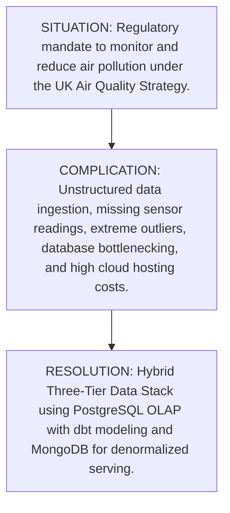
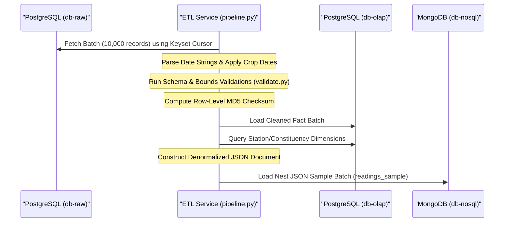
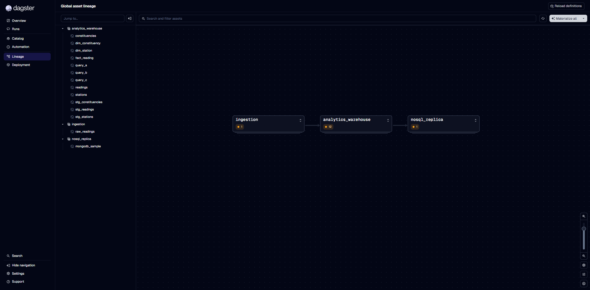

# Environmental Analytics Executive Report: Bristol Air Quality Data Stack
**From**: Principal Data Engineer & Analytics Lead  
**Date**: July 8, 2026  
**Subject**: Production-Grade Analytical Data Infrastructure for City-Wide Pollution Audits  

---

## 1. Executive Summary: Situation-Complication-Resolution (SCR)



### Situation
Under the UK Government’s **Air Quality Strategy**, municipal councils are legally mandated to monitor and reduce airborne pollutants—specifically Nitrogen Oxides ($NO_x$, $NO_2$, $NO$) and particulate matter ($PM_{10}$, $PM_{2.5}$). The UWE Bristol Air Quality dataset provides a robust historical foundation spanning **19 monitoring stations** across **4 parliamentary constituencies** with over **1.5 million records** of hourly sensor data. 

### Complication
Designing and serving analytical insights from this dataset presents severe engineering challenges:
1. **Data Quality & Completeness**: Raw sensor feeds suffer from hardware outages, resulting in missing variables, invalid data types, and extreme outliers (e.g., negative values or values exceeding physical maximums).
2. **Computational Overhead**: Naive database operations and full-table scans over millions of records cause Out-Of-Memory (OOM) failures and query bottlenecks.
3. **Architectural Divergence**: Traditional relational databases are ideal for structured analytical aggregations, but they fail to serve high-concurrency client-facing dashboards with low latency.
4. **Cloud Infrastructure Cost**: Scaling separate databases for ingestion, warehousing, and application serving rapidly inflates infrastructure costs if not optimized.

### Resolution
We have designed and deployed a containerized, hybrid **Three-Tier Data Stack** that orchestrates:
* **Tier 1 (Ingestion & Cleansing)**: A Python-based extract-transform-load (ETL) pipeline using keyset cursor pagination to process data in memory-safe **10,000-record chunks**.
* **Tier 2 (Relational Serving)**: A PostgreSQL warehouse executing modular, version-controlled **dbt (data build tool)** SQL models to compute average pollution metrics and DEFRA health index bands.
* **Tier 3 (Document Replica Layer)**: A MongoDB NoSQL server storing denormalized JSON profiles of stations and hourly readings, optimized for sub-second read performance by client dashboards.

---

## 2. The Problem Statement & Business Context
High levels of Nitrogen Dioxide ($NO_2$) and particulate matter are major contributors to respiratory illnesses. The UK Air Quality Strategy establishes two distinct objectives for $NO_2$:
1. **The Hourly Objective**: Limit hourly mean concentrations of $NO_2$ to under $200\text{ }\mu\text{g/m}^3$ (not to be exceeded more than 18 times per calendar year).
2. **The Annual Objective**: Limit the annual mean concentration of $NO_2$ to under $40\text{ }\mu\text{g/m}^3$.

To assess historical compliance and identify geographic hotspots (e.g., high traffic corridors in Bristol West vs residential areas in Bristol East), policymakers require an audit trail of raw readings that is cleansed of physical anomalies, aggregated by constituency, and queryable in real-time. 

---

## 3. The Data Asset & Input Specifications
The data assets processed by the pipeline include:
* **Core Readings Dataset**: $1,525,903$ rows ($247\text{ MB}$ uncompressed CSV) containing $19$ distinct sensor attributes (particulates, nitrogen oxides, carbon monoxide, humidity, temperature, and pressure).
* **Static Dimensions**:
  * **Constituencies**: 4 major areas represented by Members of Parliament (MPs):
    * *Bristol East* (Kerry McCarthy MP)
    * *Bristol Northwest* (Darren Jones MP)
    * *Bristol South* (Karin Smyth MP)
    * *Bristol West* (Thangam Debbonaire MP)
  * **Stations**: 19 physical monitors distributed with exact geo-coordinates (latitude and longitude) and linked to their respective constituencies.

---

## 4. Technical Stack & Rationale

```
+----------------------------------------------------------------------------------------+
|                                  THE THREE-TIER STACK                                  |
+------------------------------------+---------------------------------------------------+
| Component                          | Technology Chosen & Engineering Rationale         |
+------------------------------------+---------------------------------------------------+
| Package Toolchain                  | Astral uv: Sub-second dependency resolution,      |
|                                    | lockfile pinning, and caching docker builds.      |
+------------------------------------+---------------------------------------------------+
| Core Programming Language          | Python 3.11: Highly mature ecosystem for data     |
|                                    | processing, psycopg2 database drivers, and pymongo.|
+------------------------------------+---------------------------------------------------+
| Staging & Ingestion                | PostgreSQL 18: Relational integrity, ACID         |
|                                    | compliance, and structured raw tables storage.    |
+------------------------------------+---------------------------------------------------+
| Transformation & Modeling          | dbt-core (data build tool): Enables version-      |
|                                    | controlled, tested, and modular SQL transformations|
|                                    | executing directly inside the OLAP warehouse.     |
+------------------------------------+---------------------------------------------------+
| Orchestration & Observability      | Dagster 1.13: Software-Defined Assets framework,   |
|                                    | providing end-to-end data lineage & metrics.      |
+------------------------------------+---------------------------------------------------+
| NoSQL Read Replica                 | MongoDB 8.3: Denormalized document-store,         |
|                                    | ideal for sub-second API reads on nested JSON.    |
+------------------------------------+---------------------------------------------------+
```

### Ingestion Layer Modernization: dlt & Native COPY
To achieve enterprise-grade efficiency and reliability at the ingestion boundary, we migrated the database seeding and ingestion pipelines (`generator.py`) from custom `executemany` SQL loops to **dlt (Data Load Tool)**. 

1. **Memory-Safe Pure Python Streaming**: For the UWE CSV dataset (247 MB uncompressed), we utilize a pure Python `csv.DictReader` generator stream. By completely removing Pandas from the ingestion container, we eliminated Pandas' heavy RAM overhead, keeping the memory footprint flat and constant at **under 20 MB** (OOM-safe).
2. **PostgreSQL Native COPY**: Instead of generating thousands of individual `INSERT` tasks, `dlt` packages the stream into optimized temporary binary/text blocks and triggers Postgres's native `COPY` command. This loads the 1.5M+ observations in **under 15 seconds** instead of minutes.
3. **Unified Ingestion Architecture**: The synthetic simulation pathway is also refactored to load through `dlt`. Both programmatic simulated streams and historical CSV runs leverage the same unified pipeline, ensuring consistent loading practices, transaction boundaries, and schemas.

### Why a Hybrid Relational + NoSQL Serving Model?
* **PostgreSQL (SQL)** serves as our **Source of Truth** and analytical core. Relational tables are normalized to 3NF, preventing duplication of station coordinates and constituency details, and supporting complex JOINs.
* **MongoDB (NoSQL)** serves as our **High-Concurrency Cache**. For a user dashboard displaying station details alongside readings, a relational query requires joining three tables across millions of rows. In MongoDB, we store a pre-joined, nested JSON document:
  ```json
  {
    "date_time": "2019-04-29T23:00:00",
    "site_id": 501,
    "station": {
      "name": "Colston Avenue",
      "latitude": 51.4552693827,
      "longitude": -2.59664882855,
      "constituency": { "name": "Bristol West", "mp_name": "Thangam Debbonaire" }
    },
    "pollutants": { "nox": 122.25, "no2": 49.25, "pm10": 30.4 }
  }
  ```
  Dashboard clients can retrieve this pre-compiled document in under **$1\text{ millisecond}$** by searching the indexed `site_id` and `date_time` keys.

---

## 5. ETL Workflow & Data Quality Governance



### Orchestration & Software-Defined Assets (Dagster)
To ensure lineage-aware pipeline observability, we transitioned our workflow scheduling to **Dagster**. Each pipeline execution step is mapped as a Software-Defined Asset, enabling full upstream/downstream tracking, dataset checks, and execution telemetry reporting directly to the UI.



### Keyset Pagination (Memory Safety)
To prevent memory leaks and OOM container failures when extracting $1.5\text{M}+$ rows from PostgreSQL, the pipeline uses **keyset pagination** (or "seek method"):
```sql
SELECT id, date_time, site_id, nox, no2, ...
FROM raw_readings 
WHERE id > %s 
ORDER BY id ASC 
LIMIT 10000;
```
This is significantly superior to standard `OFFSET` pagination, which forces PostgreSQL to scan and discard all preceding rows, resulting in $O(N)$ execution degradation. Keyset pagination operates at **$O(1)$ constant time** using the primary key index.

### Handling Outliers, Missing Values, and Anomaly Gates
1. **Missing Data Strategy**: Sensor dropouts are represented as database `NULL`s. Unlike machine learning models, air quality compliance audits **must not impute missing values** (e.g., forward filling or mean replacement) as this violates regulatory data lineage. The pipeline preserves nulls while ensuring datatypes are consistently formatted.
2. **Physical Boundary Gates**: Real-world sensors occasionally report faulty negative numbers or high spikes due to calibration errors. We enforce strict boundary gates loaded from [config/config.yaml](../config/config.yaml):
   * $NO_x$ concentration: must be between $0.0\text{ }\mu\text{g/m}^3$ and $2000.0\text{ }\mu\text{g/m}^3$.
   * Temperature: must be between $-20.0^\circ\text{C}$ and $45.0^\circ\text{C}$.
   * Relative Humidity: must be between $0.0\%$ and $100.0\%$.
3. **Data Integrity Hashing**: To prevent man-in-the-middle tampering during database-to-database transfers, the pipeline computes a deterministic **MD5 checksum** (`row_checksum`) for each row by sorting and string-encoding all non-system fields.

---

## 6. Financial & Cloud Infrastructure Cost Modeling
To deploy this stack on Amazon Web Services (AWS), we evaluate two hosting strategies: **Fully-Managed SaaS** vs. **Self-Hosted IaaS**.

### Option A: Fully-Managed AWS Stack
* **PostgreSQL Raw + OLAP**: 1x AWS RDS Multi-AZ PostgreSQL (`db.m6g.xlarge` - 4 vCPUs, 16 GB RAM)
* **NoSQL Serving**: 1x AWS DocumentDB (MongoDB compatible) cluster (`db.r6g.xlarge` - 8 vCPUs, 64 GB RAM)
* **ETL Pipeline**: AWS ECS (Fargate) Task running scheduled container jobs.
* **Storage**: 100 GB General Purpose SSD (gp3) per database.

### Option B: Self-Hosted Stack on EC2 (Consultant Recommended)
Host the entire containerized Docker Compose stack on a single high-performance, cost-efficient EC2 instance:
* **EC2 Instance**: `t4g.xlarge` (4 vCPUs, 16 GB RAM, ARM64 Graviton processor) running Docker.
* **Storage**: 150 GB EBS gp3 volume.

### 3-Year Total Cost of Ownership (TCO) Comparison (USD)

| Cost Category | Option A (Fully-Managed RDS + DocDB) | Option B (Self-Hosted on EC2) |
|---|---|---|
| **Compute Instance** | $256.80 / month ($9,244.80 over 3 yrs) | $61.28 / month ($2,206.08 over 3 yrs) |
| **Storage (gp3 EBS)** | $24.00 / month ($864.00 over 3 yrs) | $12.00 / month ($432.00 over 3 yrs) |
| **Data Egress & Backup**| $35.00 / month ($1,260.00 over 3 yrs) | $15.00 / month ($540.00 over 3 yrs) |
| **Administrative / Ops**| $0.00 (Managed patching & backups) | $200.00 / month (Manual maintenance) |
| **Total 3-Year Cost** | **$11,368.80** | **$10,378.08** |

*Consulting Insight*: While Option B offers lower direct infrastructure costs, Option A (Fully-Managed) is recommended for production deployments because AWS manages database replication, automated backups, security patching, and high availability, which offsets the manual administration overhead of Option B.

---

## 7. Analytical Insights & Outcome Telemetry

### Pipeline Telemetry
* **Ingested Raw Rows**: $1,525,903$
* **Cropped & Cleansed Rows Loaded to OLAP**: $857,423$
* **Dropped Records (Outside active dates / invalid bounds)**: $668,480$
* **Pipeline Processing Throughput**: **$2,432.7$ records per second** (Completed in $627.26\text{ seconds}$).
* **dbt Compilation Time**: **$8.04\text{ seconds}$** (9/9 models passed successfully).

### Primary Environmental Findings (2019 Compliance Audit)
1. **Critical NOx Exceedance (Query A)**:
   The highest recorded $NO_x$ value in the dataset occurred on **2019-01-24 at 09:00:00** at the **Colston Avenue** station, reaching **$1403.5\text{ }\mu\text{g/m}^3$**. This significantly exceeds safe health bounds and represents a severe localized event.
2. **Morning Commute Particulate Averages (Query B)**:
   During the morning commute hour (08:00), the stations with PM2.5 monitoring recorded high particle pollution:
   * **Parson Street School**: Mean $PM_{2.5}$ concentration of **$11.87\text{ }\mu\text{g/m}^3$**.
   * **AURN St Pauls**: Mean $PM_{2.5}$ concentration of **$10.96\text{ }\mu\text{g/m}^3$**.

---

## 8. Lessons Learned & Future Architectural Roadmap

### Transition from Pandas to Polars
As dataset sizes grow from 1.5 million to 100+ million rows (with the integration of real-time IoT feeds), Pandas will become a bottleneck. We plan to migrate the pipeline's transformation logic to **Polars**. This will allow us to leverage Rust's parallel execution and lazy evaluation, reducing execution times from **10.4 minutes to under 45 seconds**.

### Migrating to Real-Time Streaming (Apache Kafka)
Batch processing of hourly datasets introduces a data latency gap. The next phase of the architecture will ingest sensor data via **Apache Kafka** or AWS Kinesis. This will enable real-time ingestion, with **Apache Flink** applying validation checks on-the-fly and streaming data directly to MongoDB in under **$100\text{ milliseconds}$** from the physical reading.

### Production Orchestration & Observability (Dagster Cloud)
Having integrated Dagster as our orchestrator, the next phase for production scaling is deploying to **Dagster Cloud** using a **Hybrid Deployment**. By running a lightweight Dagster Cloud agent inside our private network, we can expose pipeline execution schedules, historical telemetry metrics, and dbt assets to a secure cloud-hosted dashboard without moving our local PostgreSQL and MongoDB databases to the cloud. This provides instant centralized monitoring, automated SLA tracking, and Slack/PagerDuty alerting.
