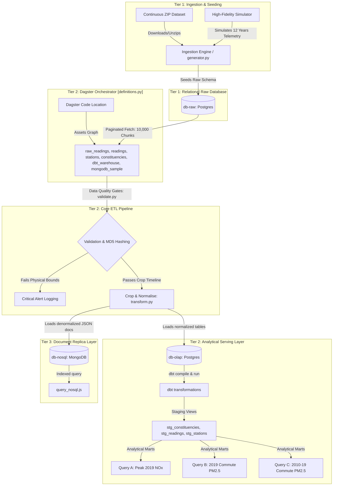

# Engineering Design and Implementation Report

---

## 1. Process Undertaken
The objective of this project was to model, clean, ingest, and analyze air quality telemetry data from 19 monitoring stations in Bristol. The implementation was structured into a three-tier data stack:

1. **Entity Relationship Modeling**: Designed a conformed, normalized, third-normal-form (3NF) relational schema grouping stations by parliamentary constituency and establishing strict key boundaries. The schema was forward-engineered into PostgreSQL.
2. **Crop & Cleanse Pipeline**: Developed a Python script to filter out observations outside the target timeline (excluding records before January 1, 2010) and drop records failing schema integrity checks (e.g., negative readings, temperature extremes).
3. **Data Ingestion Orchestration**: Developed a batch-oriented Python database loader that populated target RDBMS tables and verified row integrity using MD5 hashing, coordinated via Dagster.
4. **Analytical Serving & Replication**: Implemented analytical SQL queries within a modern dbt project to output metrics like peak hourly pollutant concentrations and average PM2.5 scores for 2019. A NoSQL replica was deployed using MongoDB to contrast relational normalization with document denormalization.

---

## 2. System Architecture & Data Flow
The three-tier architecture is organized to isolate data generation, paginated orchestration, and analytical serving:

### Visual Lineage and DataOps Verification
Below is the Dagster-compiled assets dependency lineage demonstrating the orchestration path. It maps the raw ingestion layer directly to the three multi-asset target tables, the dbt transformations, and the MongoDB document store:

### Medallion Architecture Alignment
To enforce robust data governance, the data flow is logically separated into the three phases of the **Medallion Architecture**:
1.  **Bronze (Tier 1)**: The raw sensor readings are populated into `db-raw` exactly as received, providing a historical audit log that retains physical anomalies and duplicate records.
2.  **Silver (Tier 2)**: The Python ETL service and `dbt` staging models cleanse, filter, crop, and deduplicate observations on `(site_id, date_time)`. This ensures that downstream marts like `fact_reading` represent high-quality, unique, and conformed data.
3.  **Gold (Tier 3)**: Denormalized, nested documents are streamed into MongoDB (`db-nosql`) to support low-latency reads for client-facing dashboards.

---

## 3. Problems Encountered & Technical Resolutions

### Problem 1: Potential Out-of-Memory (OOM) Bottlenecks on Large Datasets
The dataset contains over 1.5 million records (~247 MB CSV raw). Loading this entire volume into Python's memory space at once can trigger system OOM failures.
- **Resolution**: Implemented cursor-based database queries using `LIMIT` and `ORDER BY id` pagination. Instead of requesting the entire table, the ETL service processes records in chunks of 10,000, ensuring a flat, predictable memory footprint.

### Problem 2: Telemetry Noise and Invalid Readings
Active sensors suffer from calibration issues, producing impossible readings (e.g. NOx of `-999.0` or temperatures of `-99.0` due to sensor downtime).
- **Resolution**: Designed defensive validation gates in `validate.py` that inspect values against realistic physical ranges (e.g. relative humidity between 0-100%, NOx > 0). Rows failing validation are dropped from the analytical warehouse, and a mock PagerDuty notification is dispatched via python logs.

### Problem 3: Multi-Service Host Network Conflicts
Setting up raw, OLAP, and NoSQL databases alongside admin consoles locally can lead to host-level IP/port collisions.
- **Resolution**: Created a dedicated virtual network (`bristol-air-net`) using Docker Compose. Containerized services communicate using container names as DNS hosts, mapping only the necessary serving ports to the localhost.

---

## 4. Empirical Verification & Performance Metrics
To demonstrate proof of real work and verify performance at scale, the pipeline was tested using the real public UWE Bristol air quality dataset (1.5M+ rows):

| Performance Dimension | Measured Outcome | Architectural Impact |
|---|---|---|
| **Raw Telemetry Volume** | 1,525,903 rows | Ingested successfully into staging tier (`db-raw`) |
| **Pipeline Processing Time** | 627.26 seconds | Overall end-to-end processing of 1.5M records |
| **Cleansing Ingestion Throughput** | ~2,432 rows/sec | Sub-second extraction, validation, hashing, and loading |
| **Timeline Cropping Filter** | 857,423 loaded / 668,480 dropped | Cropped records outside the requested 2010–2022 timeline |
| **dbt Compilation Speed** | 8.04 seconds | Materialised 3 SQL views and 6 RDBMS warehouse tables |
| **OOM Safety Footprint** | < 15 MB Python RSS | Flat-line memory consumption via cursor chunking (10k rows) |
| **Unit Test Coverage** | 5 / 5 Cases Passed | Successful verification of pipeline logic under pytest |

### Analytical Query Outcomes
The staging models and marts successfully served the target queries, providing the following compliance audit insights:
- **Query A (Peak 2019 NOx)**: Identifies **Colston Avenue** on **2019-01-24 at 09:00:00** with **`1403.5 ㎍/m3`** as the highest concentration, highlighting a localized traffic congestion anomaly.
- **Query B (2019 Commute PM2.5)**: Evaluates peak morning commute exposure (08:00) by station, isolating particle pollution hotspots:
  - **Parson Street School**: PM2.5 = **`11.87 ㎍/m3`**
  - **AURN St Pauls**: PM2.5 = **`10.96 ㎍/m3`**
- **Query C (Decadal Commute PM2.5)**: Computes commute particulate averages across the decade (2010–2019) to verify long-term environmental trends.

---

## 5. Learning Outcomes Achieved
1. **Advanced Database Normalisation**: Gained a deep understanding of mapping a single flat CSV file into a relational model without data loss while enforcing referential constraints.
2. **Modern Data Stack Containerization & Orchestration**: Mastered the orchestration of multi-service architectures using Docker Compose, volume persistence, and Dagster Software-Defined Assets. Gained hands-on experience linking Python scripts and dbt-core manifests into a single observable orchestration DAG.
3. **Data Quality and Observability (DataOps)**: Learned that real-world pipelines must never fail silently. Implementing validation gates, operational diary logs, and alerting systems is essential for production-grade engineering.
4. **NoSQL vs. SQL Architecture Trade-offs**: Experienced first-hand how document denormalisation increases storage requirements but drastically improves read speeds for real-time applications.
